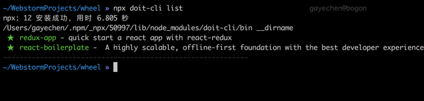

# cx-react-starterkit
从零开发一个react脚手架工具

## 简要说明
此脚手架目前内置了两个模板


- [redux-app](https://github.com/GayeChen/react-app-template): 一款从零开始结合webpack和react-redux的react模板，配置简单，适合新手学习
- [react-boilerplate](https://github.com/GayeChen/react-boilerplate): 基于一款非常火爆的第三方react模板改造，内置了当下react生态圈比较流行的一些库，例如
    - immutable.js
    - styled-component: Css in JS的一种方案
    - redux-saga
    - ...

## 快速开始

使用 npm 或者 yarn 全局安装，或者直接使用 [npx](https://medium.com/@maybekatz/introducing-npx-an-npm-package-runner-55f7d4bd282b)

```bash
$ npm install -g doit-cli
$ yarn global add doit-cli
```

使用命令创建模板项目

```bash
$ doit-cli init [模板名]

$ doit-cli list 查看可用模板
```

npm5.2+ 也可在不全局安装的情况下使用 npx 创建模板项目

```bash
$ npx doit-cli init [模板名]
```


